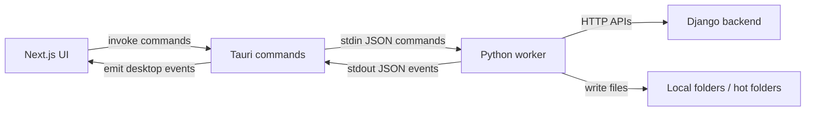

# Architecture Notes

## Runtime Responsibilities

### Tauri

Files:

- [lib.rs](/Users/danielwragg/Library/Mobile Documents/com~apple~CloudDocs/Scripts/downloader/src-tauri/src/lib.rs)
- [worker.rs](/Users/danielwragg/Library/Mobile Documents/com~apple~CloudDocs/Scripts/downloader/src-tauri/src/worker.rs)

Responsibilities:

- create and manage the native desktop window
- expose commands the UI can invoke
- launch the Python sidecar
- read worker stdout/stderr and convert it into desktop events
- persist desktop-level configuration in the app config directory
- provide tray/menu-bar behavior and hide-to-tray flow

Why it exists:

The desktop shell should own native process lifecycle and OS affordances, but it should not implement polling logic or file handling itself.

### Next.js UI

Files:

- [layout.tsx](/Users/danielwragg/Library/Mobile Documents/com~apple~CloudDocs/Scripts/downloader/apps/desktop/app/layout.tsx)
- [use-worker-store.ts](/Users/danielwragg/Library/Mobile Documents/com~apple~CloudDocs/Scripts/downloader/apps/desktop/lib/use-worker-store.ts)
- [dashboard-view.tsx](/Users/danielwragg/Library/Mobile Documents/com~apple~CloudDocs/Scripts/downloader/apps/desktop/components/dashboard-view.tsx)
- [jobs-view.tsx](/Users/danielwragg/Library/Mobile Documents/com~apple~CloudDocs/Scripts/downloader/apps/desktop/components/jobs-view.tsx)
- [logs-view.tsx](/Users/danielwragg/Library/Mobile Documents/com~apple~CloudDocs/Scripts/downloader/apps/desktop/components/logs-view.tsx)
- [settings-view.tsx](/Users/danielwragg/Library/Mobile Documents/com~apple~CloudDocs/Scripts/downloader/apps/desktop/components/settings-view.tsx)

Responsibilities:

- display machine state, queue state, job history, and logs
- submit control actions such as pause, resume, retry, and settings updates
- remain focused on visibility and operator controls, not low-level machine operations

Why it exists:

The receiver UI should stay simple and operationally focused. It is a control surface for the worker, not the system of record.

### Python Sidecar

Files:

- [worker.py](/Users/danielwragg/Library/Mobile Documents/com~apple~CloudDocs/Scripts/downloader/worker/px_receiver/worker.py)
- [backend.py](/Users/danielwragg/Library/Mobile Documents/com~apple~CloudDocs/Scripts/downloader/worker/px_receiver/services/backend.py)
- [filesystem.py](/Users/danielwragg/Library/Mobile Documents/com~apple~CloudDocs/Scripts/downloader/worker/px_receiver/services/filesystem.py)
- [state.py](/Users/danielwragg/Library/Mobile Documents/com~apple~CloudDocs/Scripts/downloader/worker/px_receiver/state.py)

Responsibilities:

- register/authenticate the machine with the backend
- poll for jobs assigned to the local machine
- claim jobs and report status transitions
- download job assets
- write files into local folders and optional hot folders
- avoid duplicate processing via local state
- report logs and health back to the desktop app

Why it exists:

Filesystem operations, printer routing, local automation, and OS-specific integrations belong in a sidecar process with a clear responsibility boundary. This keeps the UI clean and makes later extensions like barcode listeners or printer routing additive rather than invasive.

## Communication Flow

## Swap Polling Later

The worker loop currently polls on an interval, but the boundary is intentionally narrow:

- the UI only knows about snapshots, logs, jobs, and control commands
- Tauri only knows how to start the worker and relay events
- the worker owns the backend transport and job acquisition mechanism

That means polling can later be replaced by long-poll, WebSocket, webhook relay, or local queue ingestion without changing the UI architecture.

## Extension Points

Planned later additions fit into the current structure:

- barcode integration: new worker input service
- printer routing: new worker service modules
- richer machine registration: extend the backend adapter and settings schema
- local storage/history: move from JSON state to SQLite without rewriting the UI
- machine capabilities: include printer/folder capability registration in the worker auth flow
